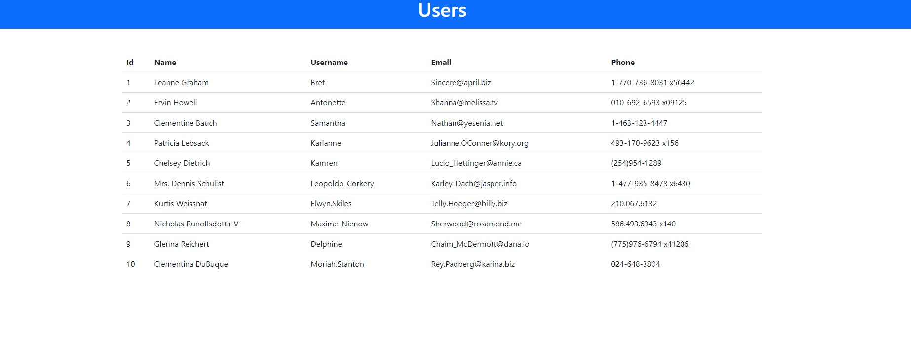

# consume-api-in-django


## Sommaire 

* [1. Installation](#Section_1) 
* [2. Views et URLs](#Section_2) 


## 1. Installation<a class="anchor" id="section_1"></a>  

````python
django-admin startproject bookapp
````

````python
python manage.py makemigrations
python manage.py migrate
````

### Create a superuser
````python
python manage.py createsuperuser
````

### Run the application
````python
python manage.py runserver
````

### Create a django App
````python
python manage.py startapp myapp
````

bookapp/setting.py :
````python
# Application definition
...
INSTALLED_APPS = [
    'django.contrib.admin',
    'django.contrib.auth',
    'django.contrib.contenttypes',
    'django.contrib.sessions',
    'django.contrib.messages',
    'django.contrib.staticfiles',
    'myapp', # ajout
]
...

TEMPLATES = [
    {
        'BACKEND': 'django.template.backends.django.DjangoTemplates',
        'DIRS': [os.path.join(BASE_DIR, 'templates')], # ajout
        'APP_DIRS': True,
        'OPTIONS': {
            'context_processors': [
                'django.template.context_processors.debug',
                'django.template.context_processors.request',
                'django.contrib.auth.context_processors.auth',
                'django.contrib.messages.context_processors.messages',
            ],
        },
    },
]
````

#### Install requests module
````python
pip install requests
````

## 2. Views et URLs<a class="anchor" id="section_2"></a>

 consume-api-in-django/bookapp/myapp/views.py :
 ````python
from django.shortcuts import render
from django.http import HttpResponse
import requests
# Create your views here.
def users(request):
    #pull data from third party rest api
    response = requests.get('https://jsonplaceholder.typicode.com/users')
    #convert reponse data into json
    users = response.json()
    print(users)
    return HttpResponse("Users")
    pass
````

myapp/urls.py : 
````python
from django.urls import path
from . import views

urlpatterns = [
    path('', views.users, name = 'users'),
]
````

bookapp/urls.py : 
````python
from django.contrib import admin
from django.urls import path, include

urlpatterns = [
    path('admin/', admin.site.urls),
    path('', include('myapp.urls')),
]
````

myapp/views.py :
````python
from django.shortcuts import render
from django.http import HttpResponse
import requests


# Create your views here.
def users(request):
    # pull data from third party rest api
    response = requests.get('https://jsonplaceholder.typicode.com/users')
    # convert reponse data into json
    users = response.json()
    # print(users)
    return render(request, "users.html", {'users': users})
    pass
````

users.html : 
````html
<!doctype html>
<html lang="en">
    <head>
        <!-- Required meta tags -->
        <meta charset="utf-8">
        <meta name="viewport" content="width=device-width, initial-scale=1">
        <!-- Bootstrap CSS -->
        <link href="https://cdn.jsdelivr.net/npm/bootstrap@5.0.2/dist/css/bootstrap.min.css" rel="stylesheet" integrity="sha384-EVSTQN3/azprG1Anm3QDgpJLIm9Nao0Yz1ztcQTwFspd3yD65VohhpuuCOmLASjC" crossorigin="anonymous">
        <script src="https://cdn.jsdelivr.net/npm/bootstrap@5.0.2/dist/js/bootstrap.bundle.min.js" integrity="sha384-MrcW6ZMFYlzcLA8Nl+NtUVF0sA7MsXsP1UyJoMp4YLEuNSfAP+JcXn/tWtIaxVXM" crossorigin="anonymous"></script>
          <title>Consume Rest Api</title>
    </head>
    <body>
        <div class="container-fluid p-2 bg-primary text-white text-center">
            <h1>Users</h1>
        </div>
        <div class="container mt-5">
            <table class="table">
                <thead>
                    <tr>
                        <th>Id</th>
                        <th>Name</th>
                        <th>Username</th>
                        <th>Email</th>
                        <th>Phone</th>
                    </tr>
                </thead>
                <tbody>
                    
                    <tr>
                        <td>{{ user.id }}</td>
                        <td>{{ user.name }}</td>
                        <td>{{ user.username }}</td>
                        <td>{{ user.email }}</td>
                        <td>{{ user.phone }}</td>
                    </tr>
                    
                </tbody>
            </table>
       </div>
    </body>
</html>
````

## Results

